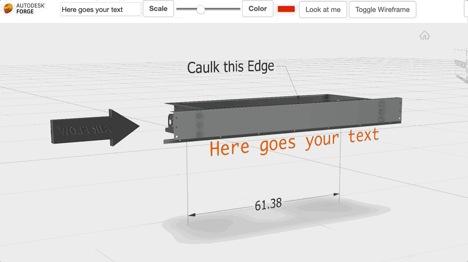
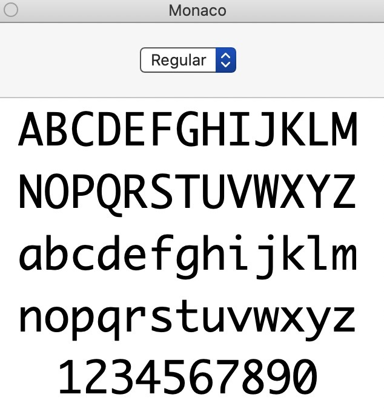

# TextGeometry Sample

This sample demonstrates how to add textgeometry to Autodesk Forge Viewer.

### DEMO: https://joaomartins-forge.github.io/textgeometry-sample/



### GETTING STARTED

First up, Forge-Viewer is still using V71. So we can't add our text using the default method (refer [here](https://threejs.org/docs/index.html?q=textgeom#api/en/geometries/TextGeometry)). Thankfully, not a whole lot has changed, to make things work - just a couple of name changes, like THREE.FontLoader().
Follow the steps below to load them.

#### STEP 1 – Choose your Font

I like the monaco.TTF true-type font, used by Sublime Text Editor, and I want to use this font style inside my three.js scene. You can find a copy from the author [here](https://github.com/todylu/monaco.ttf)



First, I upload monaco.TTF to this website FaceType.js  
This will generate a special ‘js’ file that helps the TextGeometry three.js class. Download this js, load and reference it in your app.
Something like this...

```html
<script src=" <your-font>.js"></script>
```

#### STEP 2 – Create a Text Geometry

Next, let’s create a TextGeometry mesh, and add it into a scene (Forge Viewer overlay)...

```code
//First we create the TextGeometry
let geom = new THREE.TextGeometry(text, {
  font: "monaco",
  size: size * 25,
  height: 0,
  curveSegments: 3,
});

//Here we compute it's boundingbox
geom.computeBoundingBox();

//Here we define the material for the geometry
var mat = new THREE.MeshBasicMaterial({ color: this.color });

//Here we create the mesh from using the geometry and material
this.mesh = new THREE.Mesh(geom, mat);

//Then, we set its position
this.mesh.position.x = -65;
this.mesh.position.y = -10;
this.mesh.position.z = 5;

//Now we just need to add on a custom scene on viewer
this.viewer.overlays.addScene('custom-scene');
this.viewer.overlays.addMesh(this.mesh, 'custom-scene');

```

#### STEP 3 – Clean Up

We're almost done, but if you try to load it this way, you might get an error like:

```code
Unhandled Promise Rejection: The font "your-font-name" with normal weight and normal style is missing.
```

If we take a look at our recently generated js font, we can see it verifies both \_typeface_js and \_typeface_js.loadFace.
That's our third step, we need to ensure \_typeface_js object is defined and have faces and loadFace methods referencing to THREE.FontUtils.faces and THREE.FontUtils.loadFace respectively.

That can be done adding the script below before loading your-font.js:

```html
<script>
  self._typeface_js = {
    faces: THREE.FontUtils.faces,
    loadFace: THREE.FontUtils.loadFace,
  };
</script>
```

And that's it.

To summarize, here are the steps:
1.Chose your preferred font
2.Create and insert TextGeometry to your overlay
3.Fix the self.\_typeface_js reference in <your-font>.js
